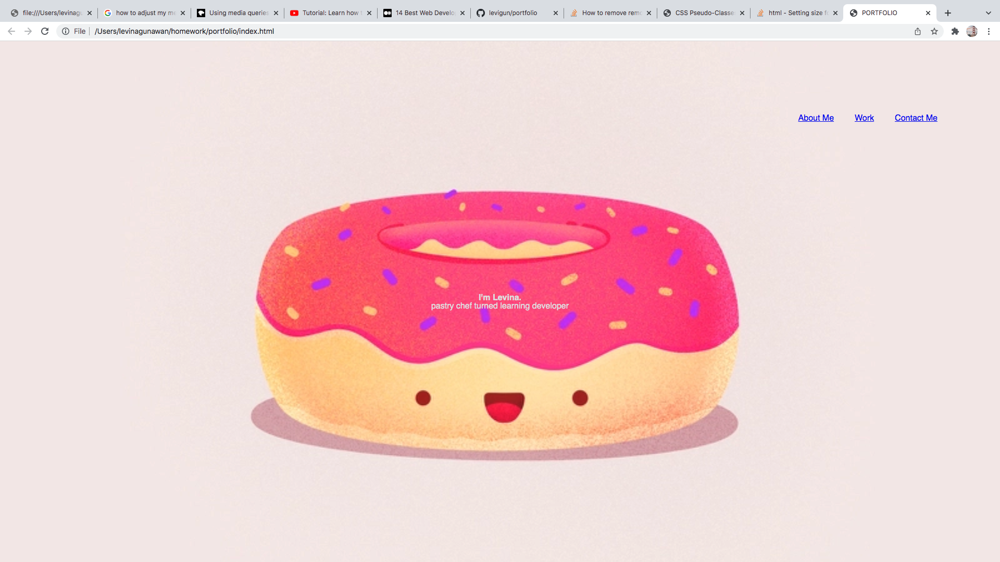

# MY PORTFOLIO

## Description

My name is Theresa Levina Gunawan and this is my first attempt in making an online portfolio. It has my basic information with a bit of my personality in the theme.

It consists of some basic and advanced CSS style but, it doesn't have a porfessional look yet. I am looking forward to creating a better edition of this portfolio after learning more coding knowledge in the coming future. Stay tuned!

## Getting Started

Follow these instructions to get the project:

1. Copy this link https://github.com/levigun/portfolio.git and clone it your computer.

2. When you're ready to deploy, use the `git add`, `git commit`, and `git push` 
commands to save and push your code to your GitHub repository.

3. This link will help you see the project in your live browser!
https://levigun.github.io/portfolio/

## Website Look

## Credits
https://coding-boot-camp.github.io/full-stack/github/professional-readme-guide

https://stackoverflow.com

## License

©2021 Theresa Levina Gunawan.

